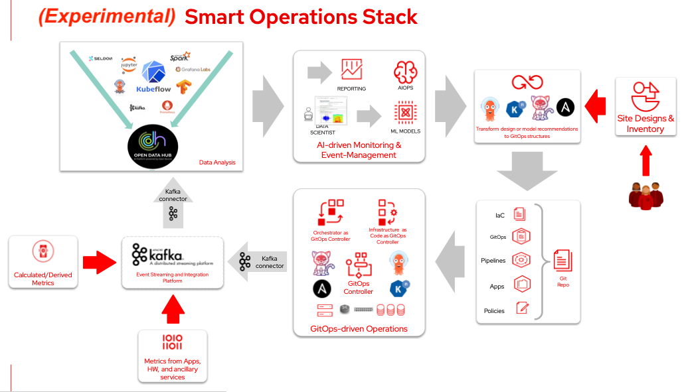

# Newton Stack (POC)

An integrated OpenShift stack for smart operation.

OpenShift stack with common elements for use cases requiring aggregation of ephemeral localized metrics for distributed analytics capapbilities supporting ML & AI, supporting intent-based auto-remediation. Applies to use cases like:

- Smart/AI-driven workload placement and management for MEC
- CO2 Aware/Power Aware/ distributed orchestration & automation
- Backend for AI-driven distributed orchestration & automation
- Backend for Autonomous Networks
- Backend for Self-Organizing Networks (SON)

## Open Data Hub Operator 1.3.0

The Open Data Hub is a machine-learning-as-a-service platform built on Red Hat's Kubernetes-based OpenShift® Container Platform. Open Data Hub integrates multiple AI/ML open source components into one operator that can easily be downloaded and installed by OpenShift users.

Open Data Hub operator allows users to install and manage Open Data Hub and Kubeflow components. Users can mix and match tools from each project to fulfill the needs of their use case. Each of the projects share some components, but can be mostly seen as an extension of each other to provide a complete solution for both novice and skilled enterprise users.

Components:

- Open Data Hub Dashboard v2.0 - NEW A web dashboard that displays installed Open Data Hub components with easy access to component UIs and documentation
- JupyterHub v0.3.7 - NEW Open source multi-user JupyterLab notebook platform w/ GPU support and High Availability.
- Elyra v3.9.1 - NEW JupyterLab notebook with support for AI workflows
- Ceph Nano v0.7 - Minimal Object Storage provided by Ceph for development use
- Prometheus - Monitoring and alerting tool
- Grafana - Data visualization and monitoring
- Airflow v1.10.11 - Workflow management
- Seldon - Open source platform for deploying machine learning models
- Argo v2.12.5 - Container-native Workflow Engine
- Apache Superset v1.4.1 - Open source application for data exploration and visualization
- Apache Kafka - The open source stream processing platform
- OpenShift Pipelines - Cloud-native CI/CD on OpenShift
- Trino v355 - Distributed analytics SQL database that supports multiple data sources
- Hue v4.8.0 - A service that provides data exploration on Hive and S3 buckets.

## Red Hat Integration - AMQ Streams 2.2.0

Supported Features:

- Manages the Kafka Cluster - Deploys and manages all of the components of this complex application, including dependencies like Apache ZooKeeper® that are traditionally hard to administer.
- Includes Kafka Connect - Allows for configuration of common data sources and sinks to move data into and out of the Kafka cluster.
- Topic Management - Creates and manages Kafka Topics within the cluster.
- User Management - Creates and manages Kafka Users within the cluster.
- Connector Management - Creates and manages Kafka Connect connectors.
- Includes Kafka Mirror Maker 1 and 2 - Allows for mirroring data between different Apache Kafka® clusters.
- Includes HTTP Kafka Bridge - Allows clients to send and receive messages through an Apache Kafka® cluster via HTTP protocol.
- Cluster Rebalancing - Uses built-in Cruise Control for redistributing partition replicas according to specified goals in order to achieve the best cluster performance.
- Monitoring - Built-in support for monitoring using Prometheus and provided Grafana dashboards

## Kube Descheduler Operator 4.10.0

There are several situations where descheduling can benefit your cluster:

- Nodes are underutilized or overutilized.
- Pod and node affinity requirements, such as taints or labels, have changed and the original scheduling decisions are no longer appropriate for certain nodes.
- Node failure requires pods to be moved.
- New nodes are added to clusters.

Once the operator is installed, you can configure one or more profiles to identify pods to evict. The scheduler will schedule the replacement of the evicted pods.

The following Descheduler Profiles are available:

- AffinityAndTaints
- TopologyAndDuplicates
- SoftTopologyAndDuplicates
- LifecycleAndUtilization
- EvictPodsWithPVC
- EvictPodsWithLocalStorage

## Custom Metrics Autoscaler 2.7.1

Custom Metrics Autoscaler for OpenShift is an event driven autoscaler based upon KEDA. Custom Metrics Autoscaler can monitor event sources like Kafka, RabbitMQ, or cloud event sources and feed the metrics from those sources into the Kubernetes horizontal pod autoscaler.

## Grafana Operator 4.7.0 

The Grafana Operator can deploy and manage a Grafana instance on Kubernetes and OpenShift. The following features are supported:
- Install Grafana to a namespace
- Configure Grafana through the custom resource
- Import Grafana dashboards from the same or other namespaces
- Import Grafana data sources from the same namespace
- Install Plugins (panels)

## Kubernetes NMState Operator 4.10.0

A Kubernetes Operator to install Kubernetes NMState for Declarative node network configuration driven through Kubernetes API.

## Red Hat OpenShift GitOps 1.6.1 

Red Hat OpenShift GitOps is a declarative continuous delivery platform based on Argo CD. It enables teams to adopt GitOps principles for managing cluster configurations and automating secure and repeatable application delivery across hybrid multi-cluster Kubernetes environments. Following GitOps and infrastructure as code principles, you can store the configuration of clusters and applications in Git repositories and use Git workflows to roll them out to the target clusters.

Features:

- Automated install and upgrades of Argo CD
- Manual and automated configuration sync from Git repositories to target OpenShift and Kubernetes clusters
- Support for the Helm and Kustomize templating tools
- Configuration drift detection and visualization on live clusters
- Audit trails of rollouts to the clusters
- Monitoring and logging integration with OpenShift
- Automated GitOps bootstrapping using Tekton and Argo CD with GitOps Application Manager CLI

## ODF LVM Operator 4.10.6

The ODF LVM Operator manages local storage using LVM.
## OpenShift Local Storage 4.10.0

Operator that configures local storage volumes for use in Kubernetes and OpenShift.
## OpenShift Data Foundation (ODF) 4.10.6

Red Hat OpenShift Data Foundation deploys three operators:
- OpenShift Data Foundation
- Rook Operator
- NooBaa Operator

## Performance Addon Operator 4.10.8

Performance Addon Operator provides the ability to enable advanced node performance tunings on a set of nodes.

## Secondary Scheduler Operator for Red Hat OpenShift 1.0.1 

The Secondary Scheduler Operator provides the ability to use a customized scheduler image that was developed using the scheduler plugin framework as a secondary scheduler in OpenShift.

## SR-IOV Network Operator 4.10.0

The sriov-network-operator is generally responsible for configuring the sriov components in a openshift cluster.

Supported Features:
- Initialize the SR-IOV NICs on nodes.
- provision SR-IOV device plugin on selected node.
- provision SR-IOV CNI plugin on selected nodes.
- manage configuration of SR-IOV device plugin.
- generate net-att-def CRs for SR-IOV CNI plugin.

## VerticalPodAutoscaler 4.10.0

An operator to run the OpenShift Vertical Pod Autoscaler. Vertical Pod Autoscaler (VPA) can be configured to monitor a workload's resource utilization, and then adjust its CPU and memory limits by updating the pod (future) or restarting the pod with updated limits.

## Red Hat OpenShift Serverless 1.24.0

The Red Hat OpenShift Serverless operator provides a collection of APIs that enables containers, microservices and functions to run "serverless". Serverless applications can scale up and down (to zero) on demand and be triggered by a number of event sources. OpenShift Serverless integrates with a number of platform services, such as Monitoring and it is based on the open source project Knative.

Components:

- Knative Serving: builds on Kubernetes to support deploying and serving of applications and functions as serverless containers. Serving simplifies the application deployment, dynamically scales based on in incoming traffic and supports custom rollout strategies with traffic splitting. Other features include:

    - Simplified deployment of serverless containers
    - Traffic-based auto-scaling, including scale-to-zero
    - Routing and network programming
    - Point-in-time application snapshots and their configurations

- Knative Eventing: provides a platform that offers composable primitives to enable late-binding event sources and event consumers. Knative Eventing supports the following architectural cloud-native concepts:

    - Services are loosely coupled during development and deployed independently to production
    - A producer can generate events before a consumer is listening, and a consumer can express an interest in an event or class of events that are not yet being produced.
    - Services can be connected to create new applications without modifying producer or consumer, and with the ability to select a specific subset of events from a particular producer.

- Serverless functions: extend Knative allowing developers to write functions that let them focus on business logic. These functions are deployed as Knative Services and take advantage of Knative Serving and Eventing. Serverless functions bring greater efficiency, more scalability and faster development that facilitate rapid go-to-market.

    - Other features include:

        - Build strategies including Source-to-Image (S2I) and Buildpacks
        - Multiple runtimes, including Node.js, Quarkus and Go
        - Local developer experience through the kn CLI
        - Project templates
        - Support for receiving CloudEvents and plain HTTP requests

## Ansible Automation Platform 2.2.1

The Ansible Automation Platform Operator includes:

- Automation controller - Define, operate, scale, and delegate automation across the enterprise.
- Private automation hub - Synchronize, manage and publish automation content to streamline Ansible code within your organization
- Platform resource operator - Define, launch, and monitor automation in a cloud-native manner

## Third party or custom services

- Intel Telmetry Aware Scheduler (TAS)
- Custom Telegraf service to read SNMP metrics from external hardware and import them as Prometheus metrics
- Kepler

